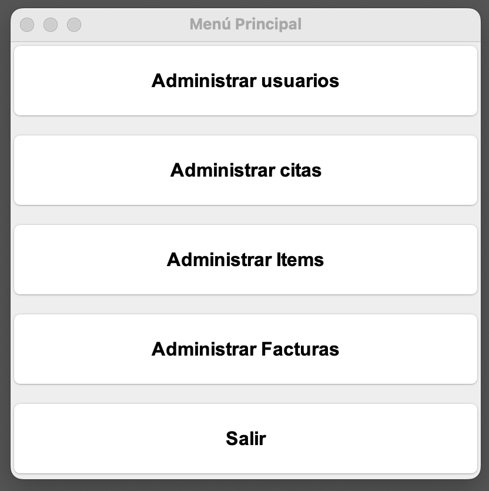
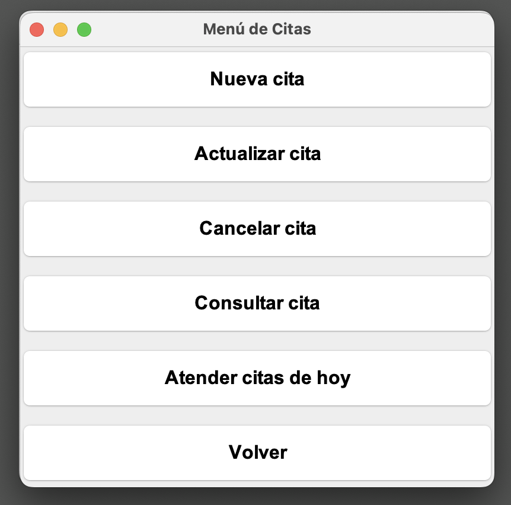
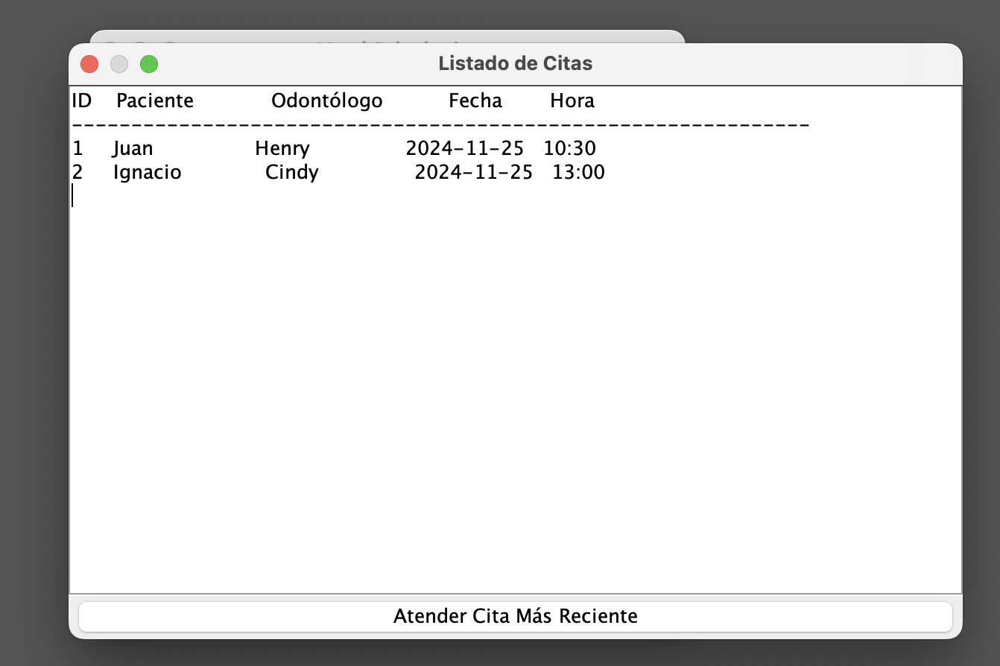
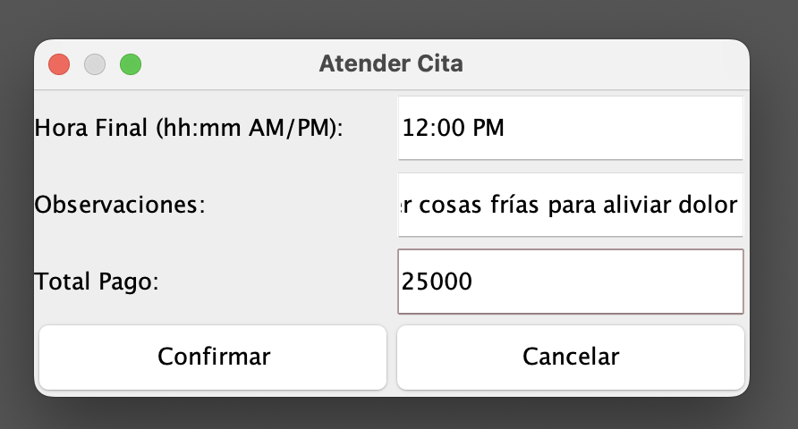
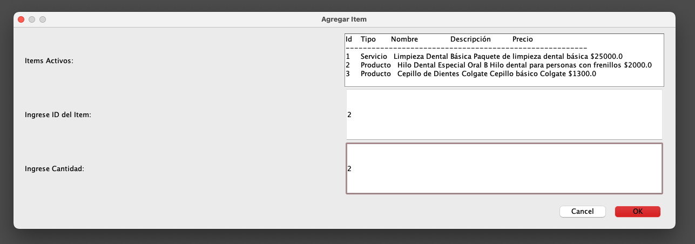
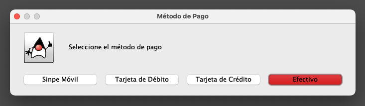
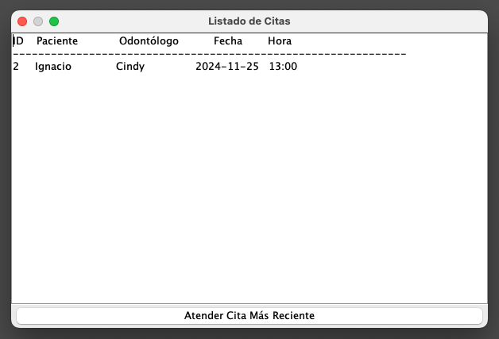

# Clinica App

## Table of Contents
- [General Info](#general-info)
- [Technologies Used](#technologies-used)
- [Features](#features)
- [Screenshots](#screenshots)
- [Room for Improvement](#room-for-improvement)

## General Info
Clinica App is a desktop application designed for dental clinics. The app uses a portable SQLite 3 database and is primarily intended for receptionists to manage appointments, invoices, patients, and dental services/products.

### User Roles:
- **Dentist**: Can be registered and updated in the system. Their status (active/inactive) can also be changed by the receptionist.
- **Patient**: Can be registered, updated, and their status managed similarly.
- **Receptionist**: The primary user of the application, responsible for managing the system.

### Key Functionalities:
- **User Management**: Add, update, and deactivate/activate dentists and patients.
- **Item Management**: Register, update, and manage the status of items categorized as either `Service` or `Product`.
- **Invoice Management**: Search for invoices by their number, cancel them, and handle associated `invoice_items` in an intermediate table for database consistency.
- **Appointment Management**: Manage a queue system to prioritize daily appointments based on start time.

The system utilizes a **Queue** data structure to manage appointments for the current date. Appointments are automatically sorted, and the receptionist processes them in order. When starting to "Attend the most recent appointment," the system:
1. Retrieves the appointment details from the top of the queue.
2. Collects the end time, observations, and total amount.
3. Provides an option to add items (services/products) to the invoice.
4. Calculates totals and commits all data (invoice, items, appointment updates) in a transactional manner.

The app also supports updating, canceling, viewing, and creating appointments. If an appointment's start time or date changes, the queue is refreshed with the latest data upon accessing the "Attend Appointments" feature.

The design is based on a layered architecture, separating connection, repositories, services, and UI layers. This promotes scalability, adaptability, and ease of maintenance, such as for database changes, business logic updates, or visual interface enhancements. Unit testing is also supported.

### Visual Interface:
The application is built using the Java Swing library for its graphical user interface.

## Technologies Used
- **Java Swing** - For building the desktop UI.
- **SQLite 3** - Portable database for storing user, appointment, item, and invoice data.
- **Java** - Core language for application logic and database interaction.

## Features
- **User Management**: Add, update, deactivate/activate dentists and patients.
- **Item Management**: Manage `Service` and `Product` items with update and status management capabilities.
- **Invoice Management**: Search, cancel, and handle invoices with associated items using a transactional approach.
- **Queue System for Appointments**: Manage daily appointments in priority order based on start time.
- **Appointment Management**: Create, update, cancel, and view appointments.
## Screenshots

## Room for Improvement
- **Login System**: Integrate a login feature to ensure only authorized receptionists can access the system.
- **Admin Role**: Introduce an admin user who can create receptionist accounts.
- **Modern Interface**: Upgrade the visual interface using newer technologies.
- **Database Migration**: Transition from SQLite 3 to MySQL for better scalability and performance.
- **Optimization**: Improve database query efficiency and data retrieval logic.
